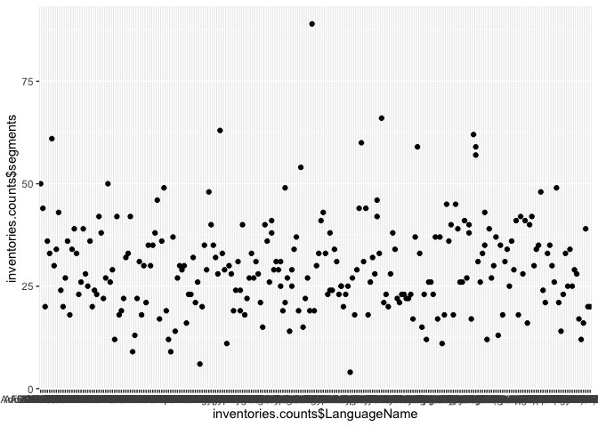
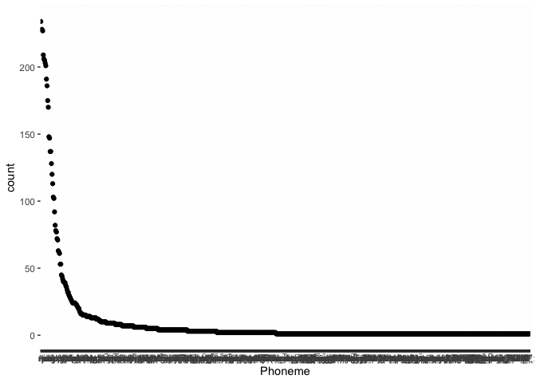
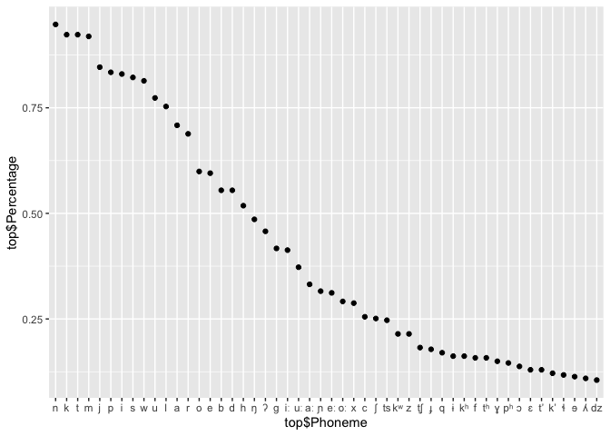
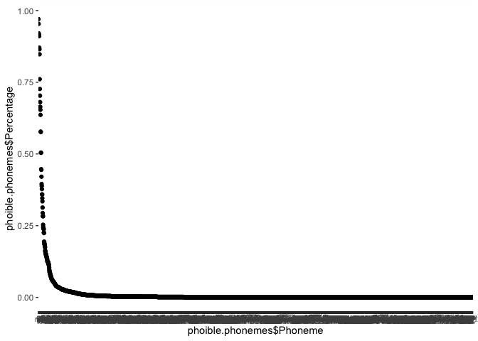
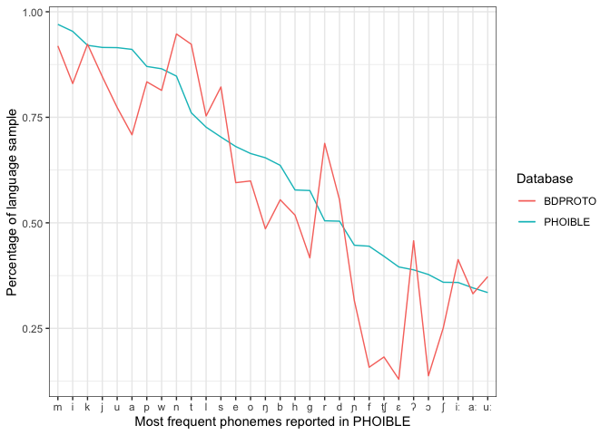
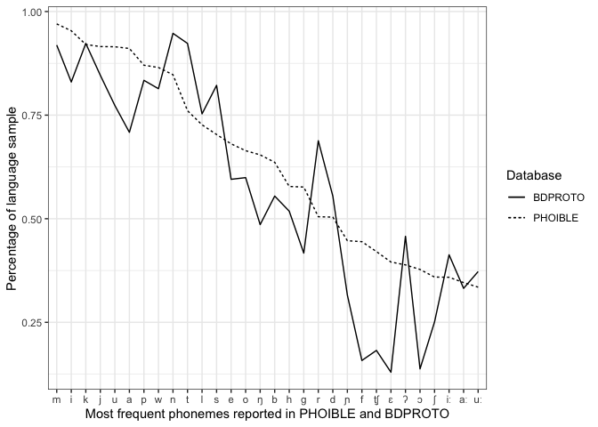
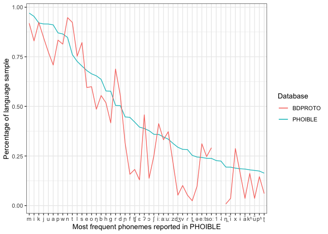

BDPROTO descriptive stats
================
Steven Moran
25 August, 2020

Some preliminary descriptive stats about the current BDPROTO data.

    library(dplyr)
    library(readr)
    library(ggplot2)
    library(knitr)

Load BDPROTO data.

    load(file='../bdproto.Rdata')

Display a subset of the data.

    kable(inventories %>% select(BdprotoID, LanguageName, Glottocode, Phoneme, LanguageFamily, TimeDepthYBP) %>% arrange(BdprotoID)) %>% head()

    ## [1] "| BdprotoID|LanguageName                 |Glottocode |Phoneme |LanguageFamily                                   | TimeDepthYBP|"
    ## [2] "|---------:|:----------------------------|:----------|:-------|:------------------------------------------------|------------:|"
    ## [3] "|         1|Proto-Berber                 |berb1260   |ɑ       |Afro-Asiatic                                     |         7000|"
    ## [4] "|         1|Proto-Berber                 |berb1260   |i       |Afro-Asiatic                                     |         7000|"
    ## [5] "|         1|Proto-Berber                 |berb1260   |u       |Afro-Asiatic                                     |         7000|"
    ## [6] "|         1|Proto-Berber                 |berb1260   |ɑː      |Afro-Asiatic                                     |         7000|"

How many total inventories are there (with duplicate languages)?

    nrow(inventories %>% select(BdprotoID) %>% unique())

    ## [1] 257

How many data points are there per data source?

    sources <- inventories %>% select(BdprotoID, LanguageName, Source) %>% 
      group_by(BdprotoID, LanguageName, Source) %>% distinct()
    table(sources$Source)

    ## 
    ##     ANE BDPROTO    HUJI      UZ 
    ##      21     101     120      15

How many unique phonemes are there?

    # TODO: some of these will have to be cleaned up, so the figure will be lower.
    nrow(inventories %>% select(Phoneme) %>% group_by(Phoneme) %>% distinct())

    ## [1] 794

How many language families are tagged?

    nrow(inventories %>% select(LanguageFamily) %>% group_by(LanguageFamily) %>% distinct())

    ## [1] 124

What are they?

    table(inventories %>% select(LanguageFamily) %>% group_by(LanguageFamily) %>% distinct()) %>% kable()

| Var1                                             | Freq |
|:-------------------------------------------------|-----:|
|                                                  |    1 |
| Afro-Asiatic                                     |    1 |
| Afro-Asiatic, Ancient-Egyptian                   |    1 |
| Afro-Asiatic, Berber                             |    1 |
| Afro-Asiatic, Chadic                             |    1 |
| Afro-Asiatic, Cushitic                           |    1 |
| Afro-Asiatic, Semitic                            |    1 |
| Afroasiatic                                      |    1 |
| Algic                                            |    1 |
| Alor-Pantor                                      |    1 |
| Arawakan                                         |    1 |
| Australian                                       |    1 |
| Australian, Pama-Nyungan                         |    1 |
| Austro-Asiatic, Katuic                           |    1 |
| Austro-Asiatic, Khmer                            |    1 |
| Austro-Asiatic, Mon                              |    1 |
| Austro-Asiatic, Vietmuong                        |    1 |
| Austro-Tai, Austronesian                         |    1 |
| Austro-Tai, Austronesian, East-Malayo-Polynesian |    1 |
| Austro-Tai, Austronesian, West-Malayo-Polynesian |    1 |
| Austro-Tai, Li-Kam-Tai                           |    1 |
| Austroasiatic                                    |    1 |
| Austronesian                                     |    1 |
| Aymaran                                          |    1 |
| Barbacoan                                        |    1 |
| Boran                                            |    1 |
| Caddoan                                          |    1 |
| Cariban                                          |    1 |
| Caucasian                                        |    1 |
| Chimakuan                                        |    1 |
| Chukchi-Kamchatkan                               |    1 |
| Dravidian                                        |    1 |
| Dravidian, Dravidian                             |    1 |
| Eskimo-Aleut                                     |    1 |
| Eskimo-Aleut, Eskimo                             |    1 |
| Eyak-Athabaskan                                  |    1 |
| Gunwinyguan                                      |    1 |
| Huavean                                          |    1 |
| Indo-European                                    |    1 |
| Indo-European, Anatolian                         |    1 |
| Indo-European, Germanic                          |    1 |
| Indo-European, Germanic, North                   |    1 |
| Indo-European, Germanic, West                    |    1 |
| Indo-European, Greek                             |    1 |
| Iroquoian                                        |    1 |
| Isolates                                         |    1 |
| Iwaidjan                                         |    1 |
| Jicaquean                                        |    1 |
| Keresan                                          |    1 |
| Khoe-Kwadi                                       |    1 |
| Khoisan, Central-Khoisan                         |    1 |
| Kiowa-Tanoan                                     |    1 |
| Koman                                            |    1 |
| Macro-Family, Nostratic                          |    1 |
| Macro-Macro-Family, Uralo-Siberian               |    1 |
| Maiduan                                          |    1 |
| Mayan                                            |    1 |
| Miwok-Costanoan                                  |    1 |
| Mixe-Zoque or Totozoquean                        |    1 |
| Muskogean                                        |    1 |
| Na-Dene, Athabaskan                              |    1 |
| Niger-Kordofanian, Bantoid                       |    1 |
| Niger-Kordofanian, Cross-River                   |    1 |
| Niger-Kordofanian, Kwa                           |    1 |
| Niger-Kordofanian, Mande                         |    1 |
| Niger-Kordofanian, Ubangi                        |    1 |
| Niger-Kordofanian, Voltaic                       |    1 |
| Nilo-Saharan                                     |    1 |
| Nilo-Saharan or Nilotic                          |    1 |
| Nilo-Saharan, Central-Sudanic                    |    1 |
| Nilo-Saharan, East-Sudanic                       |    1 |
| Nilo-Saharan, East-Sudanic, Nilotic              |    1 |
| Nilo-Saharan, Maban                              |    1 |
| North Halmahera                                  |    1 |
| North-American, Almosan                          |    1 |
| North-American, Hokan                            |    1 |
| North-American, Keresiouan                       |    1 |
| North-American, Oto-Manguean                     |    1 |
| North-American, Penutian                         |    1 |
| North-American, Uto-Aztecan                      |    1 |
| Nuclear Macro-Je                                 |    1 |
| Nuclear Trans New Guinea                         |    1 |
| Nyulnyulan                                       |    1 |
| Otomanguean                                      |    1 |
| Palaihnihan                                      |    1 |
| Pama-Nyungan                                     |    1 |
| Papuan, Geelvink-Bay                             |    1 |
| Papuan, Sepik-Ramu                               |    1 |
| Papuan, Trans-New-Guinea                         |    1 |
| Quechuan                                         |    1 |
| Salishan                                         |    1 |
| Sino-Tibetan                                     |    1 |
| Sino-Tibetan, Karenic                            |    1 |
| Sino-Tibetan, Lolo-Burmese                       |    1 |
| Sino-Tibetan, Sinitic                            |    1 |
| Siouan                                           |    1 |
| Sko                                              |    1 |
| South-American, Chibchan                         |    1 |
| South-American, Equatorial                       |    1 |
| South-American, Macro-Arawakan                   |    1 |
| South-American, Macro-Panoan                     |    1 |
| South-American, Macro-Tucanoan                   |    1 |
| Tai-Kadai                                        |    1 |
| Takelman                                         |    1 |
| Tanoan                                           |    1 |
| Tibeto-Burman                                    |    1 |
| Timor-Alor-Pantar                                |    1 |
| Totonacan or Totozoquean                         |    1 |
| Totozoquean                                      |    1 |
| Tsimshian                                        |    1 |
| Tucanoan                                         |    1 |
| Tupian                                           |    1 |
| Ural-Altaic, Ainu                                |    1 |
| Ural-Altaic, Altaic                              |    1 |
| Ural-Altaic, Finno-Ugric                         |    1 |
| Ural-Altaic, Japanese                            |    1 |
| Ural-Altaic, Samoyed                             |    1 |
| Ural-Altaic, Uralic                              |    1 |
| Uralic                                           |    1 |
| Uto-Aztecan                                      |    1 |
| Waikuruan (Guaicuruan)                           |    1 |
| Wintun                                           |    1 |
| Yokutsan                                         |    1 |

How many distinct vs duplicate data points are there?

    temp <- inventories %>% select(BdprotoID, LanguageName, Glottocode, Duplicate) %>% unique() %>% arrange(LanguageName)
    table(temp$Duplicate)

    ## 
    ## FALSE  TRUE 
    ##   178    79

That is, there are 178 independent data points and 79 duplicated ones.
Through manual inspection, we identified 3 sets of duplicates (9 data
points), and the rest are doubles. This means: 70/2=25 + 3 + 178 ==
**206 unique language data points**.

How many distinct Glottocodes are there? Some are NA (i.e. don’t exist,
e.g. Altaic) and others have not yet been identified.

    bdproto.glottocodes <- inventories %>% select(Glottocode) %>% filter(!is.na(Glottocode)) %>% unique()
    nrow(bdproto.glottocodes) # 187 without NAs or ""

    ## [1] 187

How many Glottocodes are NA (i.e. we know there exists no Glottocode at
the moment)?

    # inventories %>% group_by(BdprotoID, Glottocode) %>% select(BdprotoID, Glottocode) %>% distinct() %>% filter(n()<1)
    temp <- as.data.frame(inventories %>% select(BdprotoID, Glottocode) %>% distinct())
    table(temp$Glottocode=="") # 22

    ## 
    ## FALSE  TRUE 
    ##   224    22

    table(temp$Glottocode=="", exclude=F) # 11 NA

    ## 
    ## TRUE <NA> 
    ##   22   11

    # TODO:
    # library(testthat)
    # expect_that() # 224 + 22 + 11 = 257

Get the Glottolog family IDs (this doesn’t do much because language
families don’t have latitude, longitude, area, etc.)

    glottolog <- read.csv('glottolog_languoid.csv/languoid.csv', header=T, stringsAsFactors = F)
    glottlog.families <- glottolog %>% select(family_id) %>% distinct()

How many BDPROTO Glottocodes are in the Glottolog top-level language
family trees?

    table(bdproto.glottocodes$Glottocode %in% glottlog.families$family_id)

    ## 
    ## FALSE  TRUE 
    ##   131    56

Which ones?

    kable(bdproto.glottocodes[which(bdproto.glottocodes$Glottocode %in% glottlog.families$family_id), ])

| Glottocode |
|:-----------|
| afro1255   |
| araw1281   |
| aust1307   |
| chib1249   |
| chim1311   |
| chuk1271   |
| drav1251   |
| eski1264   |
| guah1252   |
| ijoi1239   |
| indo1319   |
| kart1248   |
| kere1287   |
| lake1255   |
| lowe1437   |
| maid1262   |
| mand1469   |
| maya1287   |
| otom1299   |
| basq1248   |
| maba1274   |
| nubi1251   |
| pomo1273   |
| sali1255   |
| taik1256   |
| toto1251   |
| tuca1253   |
| tupi1275   |
| ural1272   |
| utoa1244   |
| yoku1255   |
| mixe1284   |
| turk1311   |
| mong1329   |
| aust1305   |
| iroq1247   |
| timo1261   |
| nort2923   |
| nucl1709   |
| cadd1255   |
| quec1387   |
| ayma1253   |
| barb1265   |
|            |
| nilo1247   |
| nucl1710   |
| jica1245   |
| tsim1258   |
| gunw1250   |
| siou1252   |
| pama1250   |
| guai1249   |
| miwo1274   |
| musk1252   |
| huav1256   |
| koma1264   |

How many segments do the proto-languages have? (Note some inventories
only have consonant or vowel inventories specified, so we filter by the
`InventoryType` field.)

    inventories.counts <- inventories %>% select(BdprotoID, LanguageName, InventoryType) %>% group_by(BdprotoID, LanguageName, InventoryType) %>% summarize(segments=n()) %>% arrange(segments)

    ## `summarise()` regrouping output by 'BdprotoID', 'LanguageName' (override with `.groups` argument)

    dim(inventories.counts)

    ## [1] 257   4

Drop consonant and vowel only inventories (currently 10 data points)

    inventories.counts.cs.vs <- inventories.counts %>% filter(is.na(InventoryType))
    dim(inventories.counts.cs.vs)

    ## [1] 247   4

What is the median and mean number of segments in the sample (for full
consonant and vowel inventories)?

    summary(inventories.counts.cs.vs$segments)

    ##    Min. 1st Qu.  Median    Mean 3rd Qu.    Max. 
    ##   11.00   23.00   29.00   30.35   36.00   89.00

All segment types.

    # TODO: fix the NAs in the input data
    table(inventories$type, exclude=F)

    ## 
    ##    C    V <NA> 
    ## 5495 2125   22

Get consonant counts and stats of ALL inventories.

    inventories.consonants <- inventories %>% filter(is.na(InventoryType) | InventoryType=="consonants") %>% filter(Source!="ANE") 
    table(inventories.consonants$InventoryType, exclude=F)

    ## 
    ## consonants       <NA> 
    ##        103       6831

Get the consonant counts per inventory (252 data points).

    c.counts <- inventories.consonants %>% select(BdprotoID, Phoneme, type) %>% filter(type=="C") %>%  group_by(BdprotoID) %>% summarize(consonants = n())

    ## `summarise()` ungrouping output (override with `.groups` argument)

    summary(c.counts$consonants)

    ##    Min. 1st Qu.  Median    Mean 3rd Qu.    Max. 
    ##    5.00   15.00   19.00   21.48   26.00   69.00

Get consonant counts and stats of original BDPROTO (one data point per
genealogical unit).

    og.bdproto.cs <- inventories %>% filter(is.na(InventoryType) | InventoryType=="consonants") %>% filter(Source=="BDPROTO")

Get the consonant counts per inventory (252 data points).

    og.c.counts <- og.bdproto.cs %>% select(BdprotoID, Phoneme, type) %>% filter(type=="C") %>% group_by(BdprotoID) %>% summarize(consonants = n())

    ## `summarise()` ungrouping output (override with `.groups` argument)

    summary(og.c.counts$consonants)

    ##    Min. 1st Qu.  Median    Mean 3rd Qu.    Max. 
    ##    5.00   15.75   19.00   21.00   26.25   42.00

Get vowel counts and stats of ALL inventories.

    inventories.vowels <- inventories %>% filter(is.na(InventoryType) | InventoryType=="vowels") %>% filter(Source!="ANE")
    table(inventories.vowels$InventoryType, exclude=F)

    ## 
    ## vowels   <NA> 
    ##     42   6831

Get the vowel counts per inventory (should be 252 data points).

    v.counts <- inventories.vowels %>% select(BdprotoID, Phoneme, type) %>% filter(type=="V") %>% group_by(BdprotoID) %>% summarize(vowels = n())

    ## `summarise()` ungrouping output (override with `.groups` argument)

    summary(v.counts$vowels)

    ##    Min. 1st Qu.  Median    Mean 3rd Qu.    Max. 
    ##   2.000   6.000  10.000   9.905  13.000  29.000

Get vowel counts and stats of original BDPROTO (one data point per
genealogical unit).

    og.bdproto.vs <- inventories %>% filter(is.na(InventoryType) | InventoryType=="vowels") %>% filter(Source=="BDPROTO")

Get the consonant counts per inventory (252 data points).

    og.v.counts <- og.bdproto.vs %>% select(BdprotoID, Phoneme, type) %>% filter(type=="V") %>% group_by(BdprotoID) %>% summarize(vowels = n())

    ## `summarise()` ungrouping output (override with `.groups` argument)

    summary(og.v.counts$vowels)

    ##    Min. 1st Qu.  Median    Mean 3rd Qu.    Max. 
    ##   3.000   6.000   8.000   9.097  12.000  29.000

Plot segment counts (all inventories).

    inventories.counts$BdprotoID <- factor(inventories.counts$BdprotoID, levels=inventories.counts$BdprotoID[order(-inventories.counts$segments)])
    qplot(inventories.counts$LanguageName, inventories.counts$segments)

<!-- -->

What is the frequency of segments across the proto-languages? Use only
inventories that have both consonant and vowel descriptions.

    inventories.cs.vs <- inventories %>% filter(is.na(InventoryType))
    segment.counts <- inventories.cs.vs %>% select(Phoneme) %>% group_by(Phoneme) %>% summarize(count=n()) %>% arrange(desc(count)) %>% filter(!is.na(Phoneme))

    ## `summarise()` ungrouping output (override with `.groups` argument)

    dim(segment.counts)

    ## [1] 784   2

    head(segment.counts)

    ## # A tibble: 6 x 2
    ##   Phoneme count
    ##   <chr>   <int>
    ## 1 n         234
    ## 2 k         228
    ## 3 t         228
    ## 4 m         227
    ## 5 j         209
    ## 6 p         206

Get percentages.

    total.inventories <- nrow(inventories.cs.vs %>% select(BdprotoID) %>% distinct())
    segment.counts$Percentage <- segment.counts$count/total.inventories

Plot it.

    segment.counts$Phoneme <- factor(segment.counts$Phoneme, levels=segment.counts$Phoneme[order(-segment.counts$count)])
    ggplot(segment.counts, aes(x=Phoneme, y=count))+
    geom_point() + 
    ylab('count') +
    xlab('Phoneme')

<!-- -->

Plot just the top 50 most frequent segments.

    top <- head(segment.counts, n=50)
    # qplot(top$Phoneme, top$count)
    qplot(top$Phoneme, top$Percentage)

<!-- -->

Get phoible phonemes for comparison.

    phoible <- read_csv('https://raw.githubusercontent.com/phoible/dev/master/data/phoible.csv')

    ## Parsed with column specification:
    ## cols(
    ##   .default = col_character(),
    ##   InventoryID = col_double(),
    ##   SpecificDialect = col_logical(),
    ##   Marginal = col_logical()
    ## )

    ## See spec(...) for full column specifications.

    ## Warning: 21986 parsing failures.
    ##   row             col           expected       actual                                                                    file
    ## 21603 SpecificDialect 1/0/T/F/TRUE/FALSE Adja (Bénin) 'https://raw.githubusercontent.com/phoible/dev/master/data/phoible.csv'
    ## 21604 SpecificDialect 1/0/T/F/TRUE/FALSE Adja (Bénin) 'https://raw.githubusercontent.com/phoible/dev/master/data/phoible.csv'
    ## 21605 SpecificDialect 1/0/T/F/TRUE/FALSE Adja (Bénin) 'https://raw.githubusercontent.com/phoible/dev/master/data/phoible.csv'
    ## 21606 SpecificDialect 1/0/T/F/TRUE/FALSE Adja (Bénin) 'https://raw.githubusercontent.com/phoible/dev/master/data/phoible.csv'
    ## 21607 SpecificDialect 1/0/T/F/TRUE/FALSE Adja (Bénin) 'https://raw.githubusercontent.com/phoible/dev/master/data/phoible.csv'
    ## ..... ............... .................. ............. .......................................................................
    ## See problems(...) for more details.

    # PHOIBLE inventories are not unique (3020)
    num.phoible.inventories <- nrow(phoible %>% select(InventoryID) %>% distinct())

    # Get number of unique inventories by Glottocode (2185)
    num.phoible.inventories <- nrow(phoible %>% select(Glottocode) %>% distinct())

    # Get phoneme counts and percentages
    phoible.phonemes <- phoible %>% select(Glottocode, Phoneme) %>% group_by(Glottocode) %>% distinct() %>% group_by(Phoneme) %>% summarize(count=n()) %>% arrange(desc(count))

    ## `summarise()` ungrouping output (override with `.groups` argument)

    phoible.phonemes$Percentage <- phoible.phonemes$count/num.phoible.inventories
    head(phoible.phonemes)

    ## # A tibble: 6 x 3
    ##   Phoneme count Percentage
    ##   <chr>   <int>      <dbl>
    ## 1 m        2112      0.970
    ## 2 i        2076      0.954
    ## 3 k        2004      0.921
    ## 4 j        1993      0.915
    ## 5 u        1992      0.915
    ## 6 a        1983      0.911

    phoible.phonemes$Phoneme <- factor(phoible.phonemes$Phoneme, levels=phoible.phonemes$Phoneme[order(-phoible.phonemes$count)])

Segment counts (disregards genealogical relatedness and areal
proximity).

    phoible.counts <- phoible %>% select(InventoryID, Phoneme, SegmentClass) %>% group_by(InventoryID) %>% summarize(segments=n())

    ## `summarise()` ungrouping output (override with `.groups` argument)

    summary(phoible.counts$segments)

    ##    Min. 1st Qu.  Median    Mean 3rd Qu.    Max. 
    ##   11.00   25.00   33.00   34.92   42.00  161.00

Consonant counts (disregards genealogical relatedness and areal
proximity).

    phoible.cs <- phoible %>% select(InventoryID, Phoneme, SegmentClass) %>% filter(SegmentClass == "consonant") %>% group_by(InventoryID) %>% summarize(segments=n())

    ## `summarise()` ungrouping output (override with `.groups` argument)

    summary(phoible.cs$segments)

    ##    Min. 1st Qu.  Median    Mean 3rd Qu.    Max. 
    ##    6.00   17.00   22.00   23.93   28.00  130.00

Vowel counts (disregards genealogical relatedness and areal proximity).

    phoible.vs <- phoible %>% select(InventoryID, Phoneme, SegmentClass) %>% filter(SegmentClass == "vowel") %>% group_by(InventoryID) %>% summarize(segments=n())

    ## `summarise()` ungrouping output (override with `.groups` argument)

    summary(phoible.vs$segments)

    ##    Min. 1st Qu.  Median    Mean 3rd Qu.    Max. 
    ##    2.00    6.00    9.00   10.28   13.00   50.00

Tone counts (disregards genealogical relatedness and areal proximity).

    phoible.ts <- phoible %>% select(InventoryID, Phoneme, SegmentClass) %>% filter(SegmentClass == "tone") %>% group_by(InventoryID) %>% summarize(segments=n())

    ## `summarise()` ungrouping output (override with `.groups` argument)

    summary(phoible.ts$segments)

    ##    Min. 1st Qu.  Median    Mean 3rd Qu.    Max. 
    ##   1.000   2.000   3.000   3.377   4.000  10.000

Frequency distribution of phonemes in phoible.

    qplot(phoible.phonemes$Phoneme, phoible.phonemes$Percentage)

<!-- -->

Frequency distribution of 50 most frequent phonemes in phoible.

    top.phoible <- head(phoible.phonemes, n=50)
    qplot(top.phoible$Phoneme, top$Percentage)

<!-- -->

Combine the phoneme counts to plot them together in one graph.

    x <- phoible.phonemes
    colnames(x) <- c("Phoneme", "Phoible.count", "Phoible.percentage")
    y <- segment.counts
    colnames(y) <- c("Phoneme", "Bdproto.count", "Bdproto.percentage")
    z <- left_join(x,y)

    ## Joining, by = "Phoneme"

    rm(x,y)

    # Reorder phonemes as factor
    z$Phoneme <- factor(z$Phoneme, levels=z$Phoneme[order(-z$Phoible.count)])

Try top 30 phonemes.

    top.z <- head(z, n=30)

    ggplot(data = top.z, aes(x = Phoneme, group=1)) +
      geom_line(aes(y = Phoible.percentage, color = "PHOIBLE")) + 
      geom_line(aes(y = Bdproto.percentage, color = "BDPROTO")) +
      ylab("Percentage of language sample") +
      xlab("Most frequent phonemes reported in PHOIBLE") +
      labs(color="Database") +
      theme_bw()

<!-- -->

Try top 30 phonemes without color.

    top.z <- head(z, n=30)

    ggplot(data = top.z, aes(x = Phoneme, group=1)) +
      geom_line(aes(y = Bdproto.percentage, linetype = "BDPROTO")) +
      geom_line(aes(y = Phoible.percentage, linetype = "PHOIBLE")) + 
      ylab("Percentage of language sample") +
      xlab("Most frequent phonemes reported in PHOIBLE and BDPROTO") +
      labs(linetype="Database") +
      theme_bw()

<!-- -->

Try top 50 phonemes.

    top.z <- head(z, n=50)

    # Some phonemes occur very rarely in BDPROTO (or not at all) compared to PHOIBLE, e.g. /ts/ occurs at 2.5%. High tone not at all.
    top.z %>% filter(Phoneme=="ts")

    ## # A tibble: 1 x 5
    ##   Phoneme Phoible.count Phoible.percentage Bdproto.count Bdproto.percentage
    ##   <fct>           <int>              <dbl>         <int>              <dbl>
    ## 1 ts                519              0.238            61              0.247

    top.z %>% filter(Phoneme=="˦")

    ## # A tibble: 1 x 5
    ##   Phoneme Phoible.count Phoible.percentage Bdproto.count Bdproto.percentage
    ##   <fct>           <int>              <dbl>         <int>              <dbl>
    ## 1 ˦                 494              0.227            NA                 NA

    ggplot(data = top.z, aes(x = Phoneme, group=1)) +
      geom_line(aes(y = Phoible.percentage, color = "PHOIBLE")) + 
      geom_line(aes(y = Bdproto.percentage, color = "BDPROTO")) +
      ylab("Percentage of language sample") +
      xlab("Most frequent phonemes reported in PHOIBLE") +
      labs(color="Database") +
      theme_bw()

<!-- -->

Get dates.

    inventories.dates <- inventories.cs.vs %>% select(BdprotoID, LanguageName, LanguageFamily, TimeDepthYBP) %>% group_by(BdprotoID, LanguageName, LanguageFamily, TimeDepthYBP) %>% distinct() %>% arrange(desc(TimeDepthYBP)) %>% filter(TimeDepthYBP < 10001)
    head(inventories.dates)

    ## # A tibble: 6 x 4
    ## # Groups:   BdprotoID, LanguageName, LanguageFamily, TimeDepthYBP [6]
    ##   BdprotoID LanguageName   LanguageFamily                     TimeDepthYBP
    ##       <int> <chr>          <chr>                                     <int>
    ## 1      1061 AFRO-ASIATIC   Afro-Asiatic                              10000
    ## 2      1114 URALO-SIBERIAN Macro-Macro-Family, Uralo-Siberian        10000
    ## 3      1062 CUSHITIC       Afro-Asiatic, Cushitic                     8500
    ## 4      1084 URALIC         Ural-Altaic, Uralic                        8000
    ## 5      1053 ALTAIC         Ural-Altaic, Altaic                        7000
    ## 6      1083 CHADIC         Afro-Asiatic, Chadic                       7000

Get coverage by Glottolog macroarea.

    # Get the geo/genealogical data from Glottolog
    geo <- read.csv(url("https://cdstar.shh.mpg.de/bitstreams/EAEA0-E7DE-FA06-8817-0/languages_and_dialects_geo.csv"), stringsAsFactors = FALSE)

    # Merge with the BDPROTO data points
    temp <- left_join(bdproto.glottocodes, geo, by=c("Glottocode"="glottocode"))
    head(temp)

    ## # A tibble: 6 x 7
    ##   Glottocode name  isocodes level macroarea latitude longitude
    ##   <chr>      <chr> <chr>    <chr> <chr>        <dbl>     <dbl>
    ## 1 afro1255   <NA>  <NA>     <NA>  <NA>            NA        NA
    ## 2 algo1256   <NA>  <NA>     <NA>  <NA>            NA        NA
    ## 3 anat1257   <NA>  <NA>     <NA>  <NA>            NA        NA
    ## 4 araw1281   <NA>  <NA>     <NA>  <NA>            NA        NA
    ## 5 atha1247   <NA>  <NA>     <NA>  <NA>            NA        NA
    ## 6 atti1238   <NA>  <NA>     <NA>  <NA>            NA        NA

    # Problem here is that language family level codes, e.g. grea1284 (Greater Central Philippine), are not associated with macroarea, lat, long, etc.

    # So this number is completely off and represent essentially language isolates (which are their own family)
    table(temp$macroarea, exclude=FALSE)

    ## 
    ##                      Africa       Eurasia North America     Papunesia 
    ##             1             4            25             7             2 
    ## South America          <NA> 
    ##             1           147

    # TODO: infer the macroarea of a language family in Glottolog by it's daughter language(s)

    # Be kind and clean up the workspace
    rm(list = ls())

<!-- 
########################################################
# Merge results in segments with NA for feature values #
########################################################
inventories %>% dplyr::filter(is.na(consonantal)) %>% select(ID, Name, Glottocode) %>% unique()
missing.segments <- inventories %>% filter(is.na(consonantal)) %>% select(Phoneme) %>% unique()
write.table(missing.segments, "missing-segments.csv", sep="\t", quote = F, row.names = F)

# There are 36 languages that have one or more missing feature vectors.
dim(inventories %>% filter(is.na(consonantal)) %>% select(ID, Name) %>% unique())
no.feature.vectors <- anti_join(inventories, features)
no.feature.vectors <- no.feature.vectors %>% select(ID, Name, Phoneme, Source) %>% arrange(Name) %>% arrange(ID)
nrow(no.feature.vectors) # 91 feature vectors missing (with duplicates)
dim(no.feature.vectors %>% distinct(LanguageName)) # 36 distinct segments
head(no.feature.vectors)
-->
